# Humeka

Humeka is a mental health application designed to provide support groups, booking sessions with mental health professionals, journaling, and other features to help users improve their mental well-being.

## Table of Contents
- [Getting Started](#getting-started)
- [Running the Project](#running-the-project)
  - [Without Docker](#without-docker)
  - [With Docker](#with-docker)
- [API Documentation](#api-documentation)
- [Environment Variables](#environment-variables)

## Hosted link
`https://humeka-be.onrender.com`

## Website link
`https://humeka.vercel.app`

## API Documentation
[https://humeka-be.onrender.com/api-docs](https://humeka-be.onrender.com/api-docs)

## Figma Design
[https://www.figma.com/design/uwYxdhJhPxnvh52OxeO5fb/Humeka?node-id=0-1&p=f&t=HivTNAJIeVKr09Ka-0](https://www.figma.com/design/uwYxdhJhPxnvh52OxeO5fb/Humeka?node-id=0-1&p=f&t=HivTNAJIeVKr09Ka-0)

## Getting Started

To get started with Humeka, clone the repository and install the necessary dependencies.

```bash
git clone https://github.com/M-Umwari/humeka-be.git
cd humeka-be
```

## Running the Project

### Without Docker

Ensure you have **Node.js** and **PostgreSQL** installed before proceeding.

1. Install dependencies:
   ```bash
   npm install
   ```

2. Create a `.env` file in the root directory and configure your environment variables. (See [Environment Variables](#environment-variables))


3. Start the server:
   ```bash
   npm run dev
   ```

4. The application should now be running at `http://localhost:3000`

### With Docker

1. Ensure **Docker** and **Docker Compose** are installed.

2. Run the application using Docker Compose:
   ```bash
   docker-compose up --build
   ```

3. The application should now be running at `http://localhost:3000`

4. To stop the containers:
   ```bash
   docker-compose down
   ```

## Environment Variables

Create a `.env` file in the project root and add the necessary environment variables:

```
PORT=3000
DB_HOST=
DB_PORT=
DB_USERNAME=
DB_PASSWORD=
DB_NAME=
JWT_SECRET=
```

Modify these values based on your setup.

## Interface

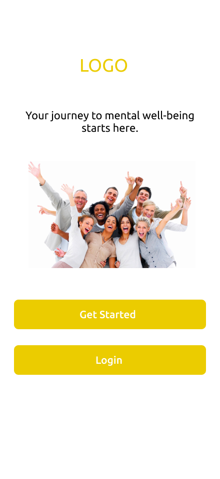
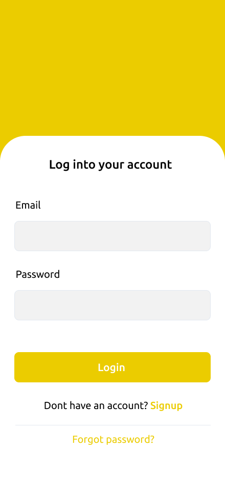
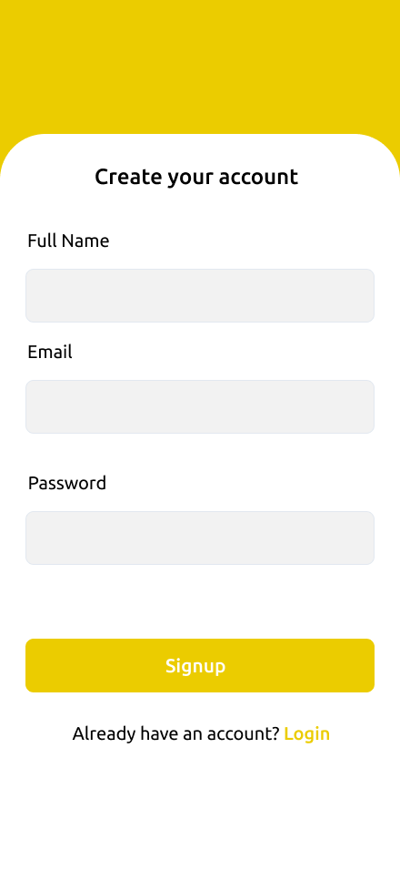
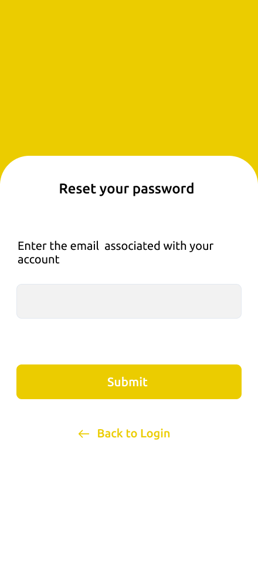

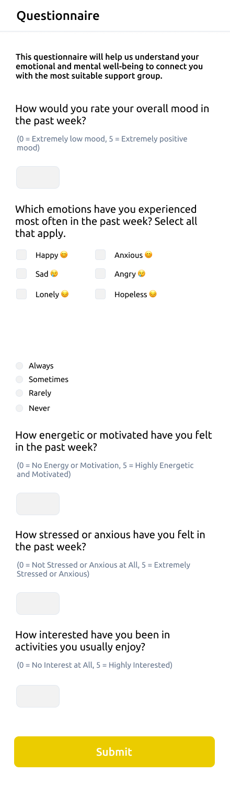
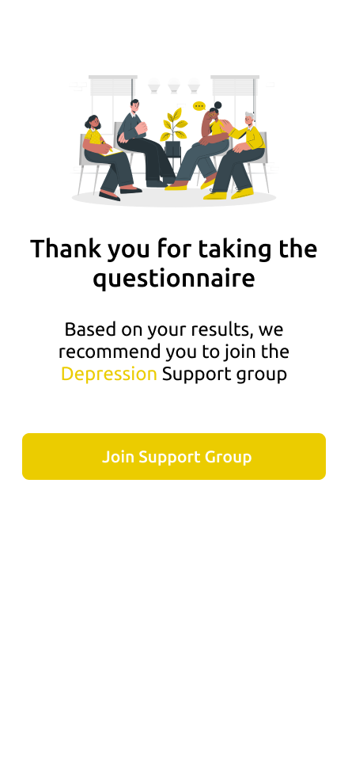
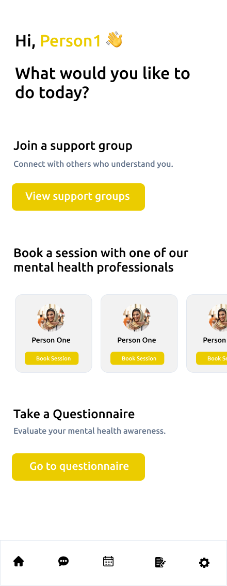
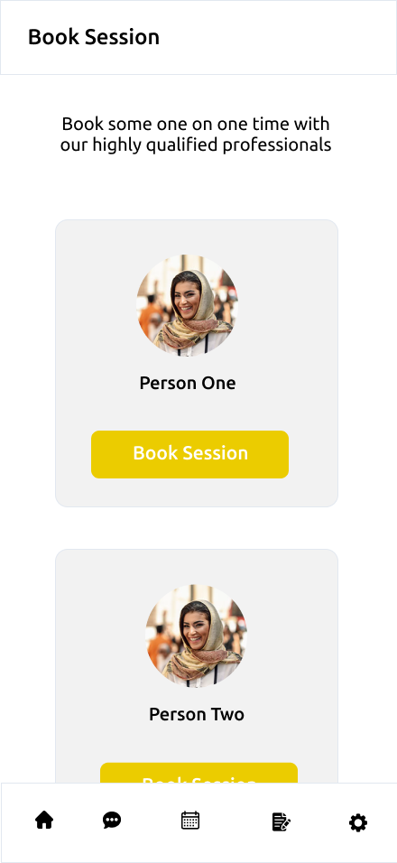
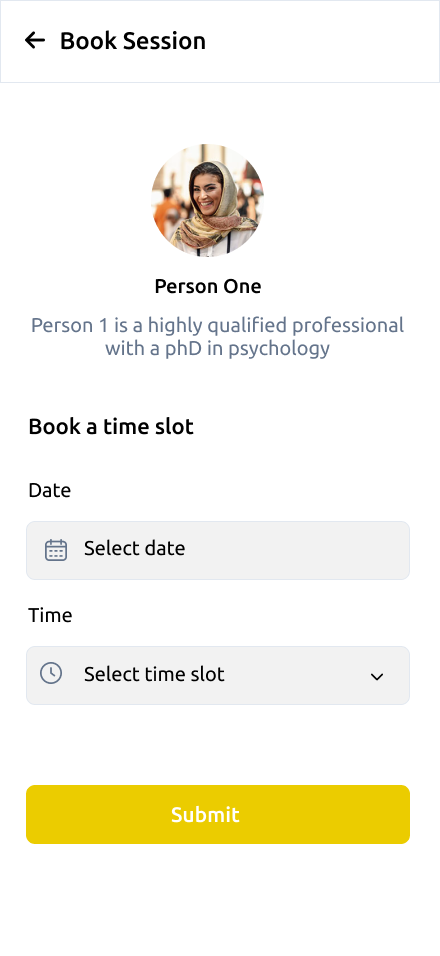
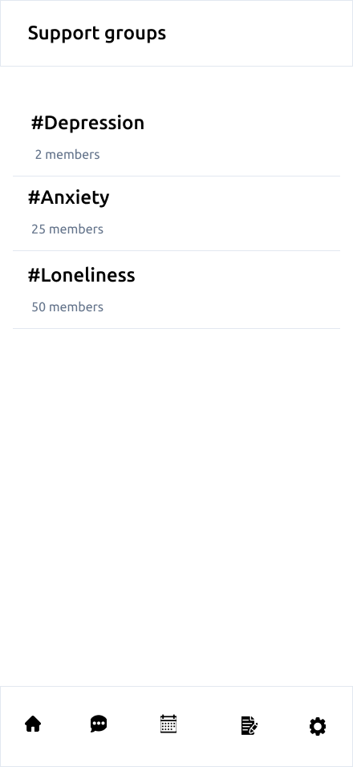

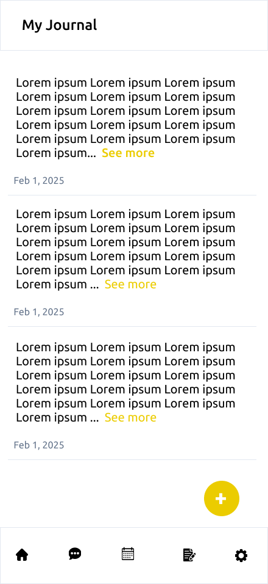
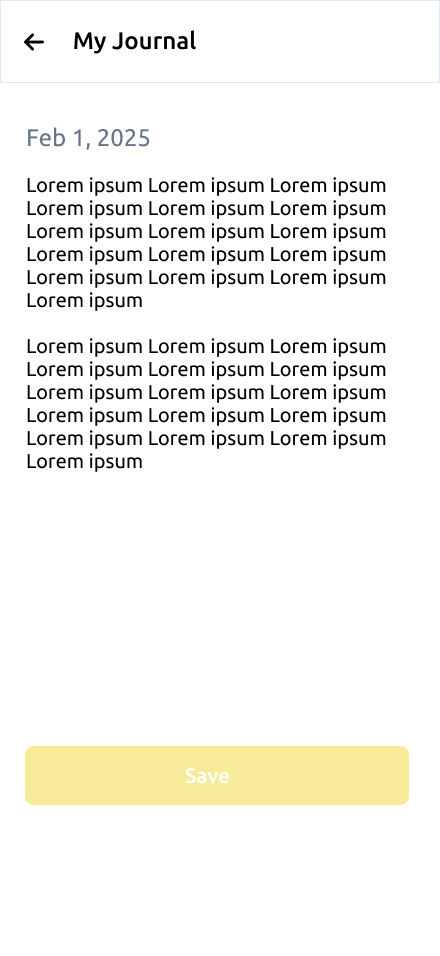
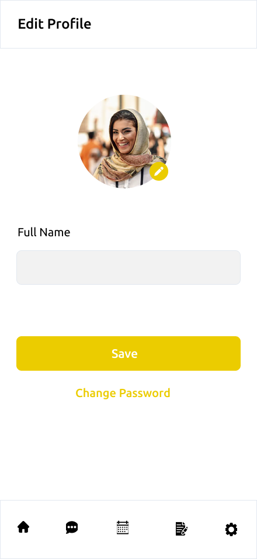
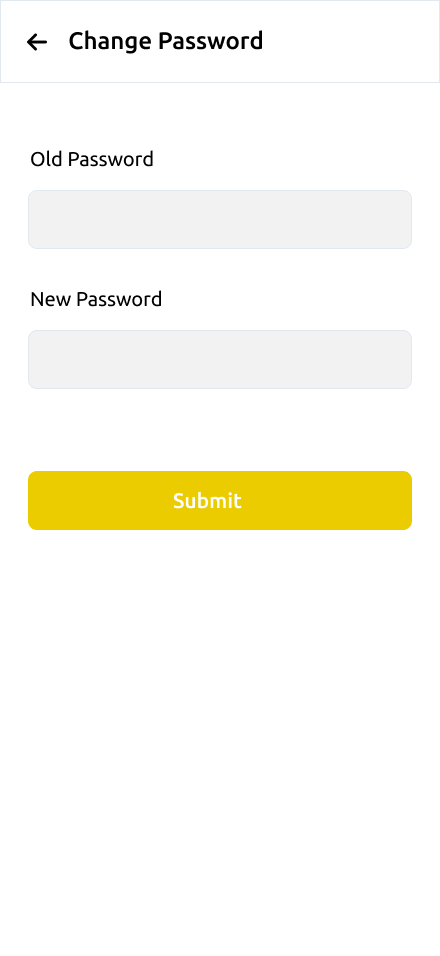